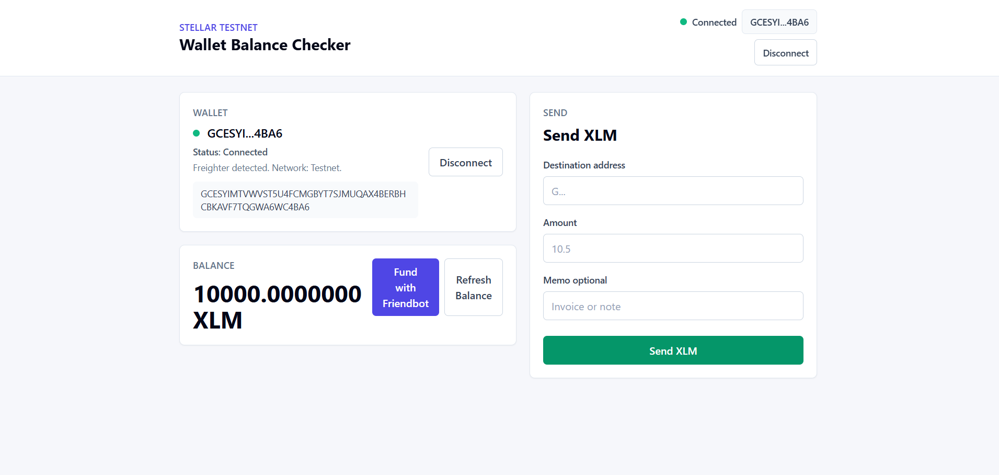

# Stellar Testnet Wallet Balance Checker

## Project Description

Stellar Testnet Wallet Balance Checker is a React app for connecting a Freighter wallet on Stellar Testnet, viewing the connected wallet address, checking the wallet's XLM balance, funding the account with Friendbot, and sending signed Testnet XLM transactions through Freighter.

Note: the workspace currently contains a Vite React app, not a Next.js App Router app. The wallet integration is implemented in the existing Vite structure so current functionality stays intact.

## Screenshot



## Setup Instructions

Install dependencies:

```bash
npm install
```

Run the app locally:

```bash
npm run dev
```

Open the local URL printed by Vite, usually:

```text
http://127.0.0.1:5173
```

Build for production:

```bash
npm run build
```

Required wallet dependencies:

- `@stellar/freighter-api`
- `@stellar/stellar-sdk`

The app uses Stellar Testnet through `https://horizon-testnet.stellar.org`.

## Files

- `src/App.jsx`: main app shell, navbar wallet status, and layout.
- `src/hooks/useStellarWallet.js`: reusable wallet hook for connect, disconnect, balance refresh, Friendbot funding, and payment submission.
- `src/utils/freighter.js`: Freighter API wrapper for install checks, access requests, Testnet checks, signing, and user-friendly wallet errors.
- `src/utils/stellar.js`: Stellar SDK helpers for address validation, amount validation, balance loading, Friendbot funding, transaction building, and transaction submission.
- `src/components/WalletConnect.jsx`: wallet status card with connect/disconnect controls and full connected address.
- `src/components/BalanceDisplay.jsx`: XLM balance card with loading state, refresh, and Friendbot funding.
- `src/components/SendTransaction.jsx`: XLM send form with validation, Freighter approval flow, transaction result, hash, amount, recipient, and Stellar Expert link.

## Friendbot Testnet XLM

After connecting a Freighter Testnet account, click `Fund with Friendbot`.

You can also fund manually in a browser:

```text
https://friendbot.stellar.org?addr=YOUR_TESTNET_PUBLIC_KEY
```

Friendbot only works on Stellar Testnet accounts.

## Testing

1. Wallet connection
   Open the app, unlock Freighter, switch Freighter to Testnet, and click `Connect Wallet`. Confirm access in Freighter. The navbar and wallet card should show `Connected` and the wallet address.

2. Balance retrieval
   After connecting, the balance card loads the XLM balance. If the account is not funded, use `Fund with Friendbot`, then confirm the balance refreshes.

3. Successful Testnet transaction
   Enter a valid Stellar Testnet recipient address and a positive XLM amount with up to 7 decimal places. Click `Send XLM`, approve the transaction in Freighter, and wait for submission to Horizon.

4. Transaction result
   On success, the app shows the transaction hash, amount sent, recipient address, and a Stellar Expert Testnet Explorer link. On failure, the app shows a readable error such as invalid address, insufficient balance, unfunded destination, locked wallet, or rejected approval.
